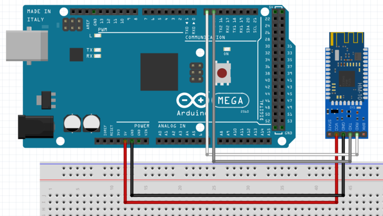

2018/9/7 

2개월만에 만나서 다시 꺼낸 대학 졸업작품 아두이노..

오랫만에 하니까 기억도 안나는데, 문서화 작업도 제대로 안해놔서 이번참에 하려고 함.

---

## Arduino IDE

### Bluetooth 통신

```c
#include <SoftwareSerial.h>

// 블루투스모듈(HM-10) 의 TX가 아두이노의 D2
// 블루투스모듈(HM-10) 의 RX가 아두이노의 D3
SoftwareSerial BTSerial(2,3); 

// 전처리
void setup() {

  // 블루투스와 전송속도 맞춰줘야 함
  Serial.begin(9600);
  BTSerial.begin(9600);

  }

// 무한루프
void loop() {
  
  if (BTSerial.available()) {
    Serial.write(BTSerial.read());
  }

  if (Serial.available()) {
    BTSerial.write(Serial.read());
  }
    
}
```



시리얼 모니터로 AT 입력 시, OK 뜨면 **성공**

&nbsp;
&nbsp;

### Main Code

**Blynk - 라즈베리파이 - 아두이노** 로 통신하기 위한 코드

사실 아두이노에서 하는 것은

블루투스 신호로 데이터를 받는 코드와 

데이터에 따른 function만 정의하면 끝임

&nbsp;

라즈베리파이에서 아두이노 MAC address를 이용하여 신호를 보냄.

```c
#include <Servo.h>
#include <SoftwareSerial.h>

// 블루투스모듈(HM-10) 의 TX가 아두이노의 D2
// 블루투스모듈(HM-10) 의 RX가 아두이노의 D3
SoftwareSerial BTSerial(2,3);

Servo myservo;  // 서보를 제어할 서보 오브젝트를 만듭니다.


// hyper-parameter
int pos_init = 95; // 서보모터 시작 각도
int angle = 40; // 움직일 각도 ( +angle / -angle )
int angleSpeed = 2; // 속도는 angleSpeed에 비례
int delayTime = 20; // 속도는 delayTime에 반비례

int pos_on = pos_init - angle;
int pos_off = pos_init + angle;
int pos = 0;
boolean isOn = false;

void setup() { 

  //블루투스와 속도 동기화
  Serial.begin(9600);
  BTSerial.begin(9600);

  myservo.attach(5);  // D5 : 서보모터
  pinMode(4, INPUT_PULLUP); // D4 : 버튼
} 
 
 
void loop() {

   // 블루투스 통신
  if(BTSerial.available()) {
      delay(100);
      char c = BTSerial.read();
      Serial.write(c);  //시리얼 확인용
     
      if(c == '1' && !isOn) { //on

       isOn = true;
       
       for(pos = pos_init; pos > pos_on; pos -= angleSpeed) {
          myservo.write(pos);
          delay(delayTime);
        } 
      }
   
      if(c == '2' && isOn) { //off

       isOn = false;
       
       for(pos = pos_init; pos < pos_off; pos += angleSpeed) {
        myservo.write(pos);             
        delay(delayTime);               
       } 
      }
  
    delay(200);                       
    myservo.write(pos_init);          
    delay(100);

  }

   // 버튼
  if (digitalRead(4) == LOW) {

    if(!isOn) {
       isOn = true;
       for(pos = pos_init; pos > pos_on; pos -= angleSpeed) {
        myservo.write(pos);           
        delay(delayTime);             
      } 
      
     }else {
       isOn = false;
       for(pos = pos_init; pos < pos_off; pos += angleSpeed) {
       myservo.write(pos);             
       delay(delayTime);               
      } 

    delay(200);          
    myservo.write(pos_init);
    delay(100);
 
  }
  
   if (Serial.available()) {
    BTSerial.write(Serial.read());
  }
  
}


void turnOn() {
  isOn = true;
  for(pos = pos_init; pos > pos_on; pos -= angleSpeed) {
     myservo.write(pos);
     delay(delayTime);
  }
}

void turnOff() {
  isOn = false;
  for(pos = pos_init; pos < pos_off; pos += angleSpeed) {
    myservo.write(pos);
    delay(delayTime);
  }
}
```

&nbsp;
&nbsp;

### 블루투스 모듈 초기화

일반적으로 초기화하려면 `AT+RENEW`, `AT+RESET` 하면 된다.

아래는 라즈베리파이와 블루투스 연결이 되지 않을 때, 

블루투스 모듈(HM-10)을 초기화 해보는 방법임.

&nbsp;

**Arduino IDE - 시리얼 모니터**

```python
AT
AT+RENEW # 공장 초기화
AT+RESET # 모듈 재시작
AT+IMME1 # Auto-Connect 하지 않겠다. 명령(AT+START) 줄 때까지 기다려!
AT+ROLE0 # 제 모듈은 Slave 입니다. (AT+ROLE1 : 제모듈은 Master 입니다.)
AT+START # Connect 명령
```

[AT 커맨드 정리](http://blog.naver.com/PostView.nhn?blogId=xisaturn&logNo=220712028679) 에서 도움 받음.

&nbsp;
&nbsp;

---

## 라즈베리 파이

vnc viewer 이용

```bash
cd ~/Capstone/ble

# 대기중인 블루투스 MAC Address 확인
python blecomm.py

# 블루투스로 message 전송
python blecomm.py + MAC Address

```